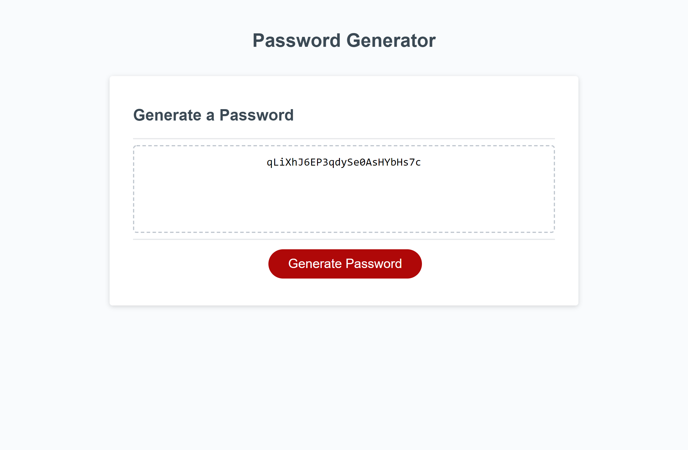

# password-generator

The contents of this repository are a password generator application. When the Generate Password button is pressed, it will prompt the user for the following parameters:
```
    Password length (selected by entering a value in a prompt. required length is a number between 8 and 128 characters)
    Inclusion of lowercase characters (selected by choosing okay or cancel)
    Inclusion of uppercase characters (selected by choosing okay or cancel)
    Inclusion of numeric characters (selected by choosing okay or cancel)
    Inclusion of special characters (selected by choosing okay or cancel)
```
In the case where the length parameter does not fall in the required range, the program will alert the user and prompt again.
As long as at least one character parameter is selected, the program will proceed. Otherwise, it alerts the user and starts over.
Once all parameter requirements are met, a random password of the specified length will be generated using the selected character types and displayed in the text box.

The deployed website can be found at: [alextheordinary.github.io/password-generator/](https://alextheordinary.github.io/password-generator/)

This is a screenshot of the completed application:


